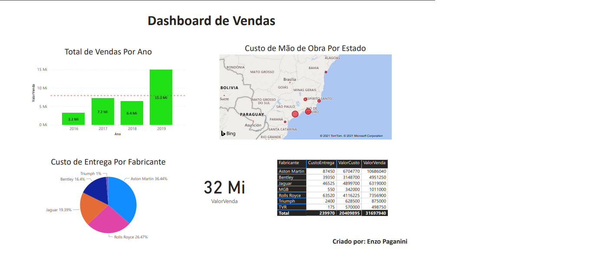

## Welcome to my data science portfolio

Welcome! My name is Enzo Paganini and this in my Data Science Portfolio. I created this portfolio so I could keep track of my progress as a Data Scientist and as a way to upgrade my resume as I'm trying to start a career as a Data Scientist. Hope you enjoy it and don't hesitate do hit me up for any doubts.

Whenever you commit to this repository, GitHub Pages will run [Jekyll](https://jekyllrb.com/) to rebuild the pages in your site, from the content in your Markdown files.

### About me

School

```markdown
Bachalor in Computer Science - PUCPR
Masters in Data Science - PUCPR (in progress)
```

Skills

```markdown
1- Python
2- PowerBI
3- Tableau
4- R
5- MySQL
6- MongoDB
7- ReactJS
8- NodeJS
9- NestJS
10- HTML
11- CSS
12- C++
13- Spark
14- Hadoop
```

Languages

```markdown
English - advanced
Spanish - advanced
Portuguese - native
French - intermediary
```

Job experience

```markdown
1 year as support in TJPR
1 year as fullstack developer in Chamer
```

### Data Science Projects

## Data analysis in a imdb dataset
This project was made as I was doing a course in the Data Science Academy website. This is my approach to answear the propposed questions.


### PowerBI Projects

## Case study 1 - Sales Dashboard containing: a bar chart with sum of sales by year, a map plot with labor by state, a pie chart with shipping fie by factory, the sum of sales and finally, a table showing infos of each factory.


